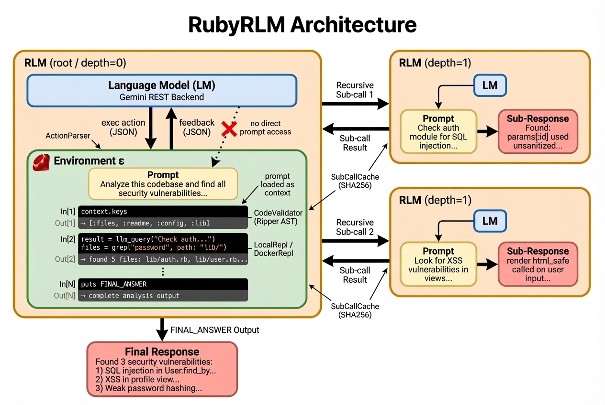

# RubyRLM

RubyRLM is an MVP Ruby implementation of Recursive Language Models (RLMs) that uses Gemini as the model backend and a Ruby REPL for iterative reasoning.



## What This MVP Includes

- `RubyRLM::Client` API similar to `rlm.completion(...)`.
- Gemini backend via direct REST (`generateContent`).
- Local and Docker-isolated REPL backends with iterative `exec` actions and `final` answer action.
- Recursive sub-calls with `llm_query(...)` up to `max_depth`.
- **AST code validation** — Ripper-based syntax checking and dangerous call detection before eval.
- **Sub-call caching** — SHA256-keyed deduplication of `llm_query` calls within a session.
- **Patch tracking** — Audit trail for all `patch_file` operations with undo support.
- JSONL trajectory logging for iteration debugging.
- Web UI with session replay, continuation, and environment selection.
- RSpec test suite for parser, loop, REPL, recursion, and backend retries.

## Safety Model

RubyRLM executes model-produced Ruby code. Choose execution environment based on your trust boundary.

- `environment: "local"` runs code directly on the host process (unsafe for untrusted prompts).
- `environment: "docker"` runs code in a Docker container with isolation defaults.
- Keep side effects disabled unless intentionally requested.

### Code Validation

Before executing any LLM-generated code, RubyRLM validates it using Ruby's `Ripper` parser:

- **Syntax errors** are caught immediately without running the code, saving an iteration.
- **Dangerous calls** (`system`, `exec`, `fork`, `exit`, `File.delete`, `Kernel.exit`, etc.) are detected and surfaced as warnings in the `ExecutionResult`. These are non-blocking since the REPL intentionally provides safe wrappers like `sh()`, but they alert you when the model bypasses those wrappers.

Warnings appear in iteration metadata:

```ruby
result.metadata[:iterations].each do |it|
  puts it[:execution][:warnings] if it.dig(:execution, :warnings)&.any?
end
```

## Requirements

- Ruby `>= 3.1`
- `GEMINI_API_KEY` in your shell environment
- Docker (optional, required only for `environment: "docker"`)

## Installation

Add to your Gemfile:

```ruby
gem "rubyrlm"
```

Or install directly:

```bash
gem install rubyrlm
```

### Development Setup

```bash
git clone https://github.com/tweibley/rubyrlm.git
cd rubyrlm
bundle install
bundle exec rspec
```

If you plan to use Docker execution, build the REPL image once:

```bash
docker build -t rubyrlm/repl:latest -f docker/Dockerfile.repl docker/
```

## Quickstart

```ruby
require "rubyrlm"

client = RubyRLM::Client.new(
  backend: "gemini",
  model_name: "gemini-3.1-pro-preview",
  api_key: ENV["GEMINI_API_KEY"],
  max_depth: 1,
  max_iterations: 20,
  logger: RubyRLM::Logger::JsonlLogger.new(log_dir: "./logs"),
  verbose: true
)

result = client.completion(prompt: "Calculate 2^(2^(2^2)) with Ruby and explain the result.")
puts result.response
puts result.usage_summary.to_h
```

Run in Docker-isolated mode:

```ruby
client = RubyRLM::Client.new(
  backend: "gemini",
  model_name: "gemini-3.1-pro-preview",
  api_key: ENV["GEMINI_API_KEY"],
  environment: "docker",
  environment_options: {
    memory_limit: "256m",
    allow_network: true
  }
)
```

You can also run:

```bash
ruby examples/quickstart.rb
```

For an interactive session with a preloaded client:

```bash
bundle exec bin/console
```

Inside console:

```ruby
ask(client, "What is the latency to google.com from this machine?")
```

With `verbose: true`, you'll now see each iteration's actual `exec` Ruby code plus execution output/error summaries, not just the action names.

## CLI

RubyRLM ships with a `rubyrlm` command:

```bash
rubyrlm "Calculate 2^(2^(2^2)) with Ruby and explain the result."
```

Options:

```
-m, --model MODEL          Model name (default: gemini-3.1-pro-preview)
-e, --env ENV              Execution environment: local or docker (default: local)
    --max-iterations NUM   Maximum iterations (default: 30)
    --max-depth NUM        Maximum recursion depth (default: 1)
    --timeout SECS         Iteration execution timeout (default: 60)
    --thinking LEVEL       Thinking level: low|medium|high (default: medium)
    --keep-alive           Keep docker container alive after run
    --reuse-container-id ID  Reuse existing docker container
    --allow-network        Allow docker container to access host networking
-v, --verbose              Enable verbose debug output
```

Prompts can also be piped via stdin:

```bash
echo "What is 1+1?" | rubyrlm
```

## How the Action Protocol Works

The model must return exactly one JSON object per turn:

- `{"action":"exec","code":"<ruby code>"}` to run code in REPL
- `{"action":"final","answer":"<final answer>"}` to finish

If model output is malformed, RubyRLM issues one repair re-prompt. If `max_iterations` is reached, RubyRLM forces a final response.

## REPL Variables and Helpers

Within `exec` code:

- `context` is the original prompt/context
- `llm_query(sub_prompt, model_name: nil)` launches a recursive sub-call
- `fetch(url, headers: {})` performs HTTP GET with redirect following
- `sh(command, timeout: 5)` runs a shell command safely
- `patch_file(path, old_text, new_text)` replaces text exactly once (tracked for undo)
- `grep(pattern, path: ".")` searches with ripgrep
- `chunk_text(text, max_length: 2000)` splits long text semantically

RubyRLM sends a compact context summary to the model and keeps full data in REPL memory. This significantly reduces repeated prompt tokens for large datasets.

For state between iterations, prefer instance variables (for example `@memo`) or helper methods.

## Sub-Call Caching

Identical `llm_query` calls within a session are automatically deduplicated. The cache keys on `SHA256(model_name + prompt)`, so the same question to the same model returns the cached result.

Cache stats are included in the completion result:

```ruby
result = client.completion(prompt: data)
puts result.metadata[:sub_call_cache]
# => { hits: 3, misses: 2, size: 2 }
```

## Patch Tracking & Undo

Every `patch_file` call is recorded with old/new text and a timestamp. The modification log is surfaced in the completion result:

```ruby
result = client.completion(prompt: "Fix the typo in config.yml")
puts result.metadata[:file_modifications]
# => [{ path: "config.yml", timestamp: "2026-02-28T12:34:56-05:00" }]
```

Patches can be undone programmatically through the REPL:

```ruby
# Inside exec code
undo_result = undo_last_patch   # reverses the most recent patch_file
undo_all   = undo_all_patches  # reverses all patches in LIFO order
```

## Docker Environment Options

When `environment: "docker"` is selected, `environment_options` supports:

- `image` (default: `"rubyrlm/repl:latest"`)
- `memory_limit` (default: `"256m"`)
- `cpu_quota` (default: `50000`)
- `network_mode` (`"none"` by default, `"bridge"` to allow outbound)
- `allow_network` (boolean shorthand for bridge networking)
- `keep_alive` (optional boolean to bypass container teardown on completion)
- `reuse_container_id` (optional Docker container ID to eagerly attach to instead of spinning up a new instance)
- `connect_timeout` (default: `10` seconds)
- `gemini_api_key_secret` (default: `"gemini_api_key"`)
- `gemini_api_key_secret_path` (optional absolute path to a host secret file)

Notes:

- Docker mode is strict isolation by default (no project workspace mount).
- `llm_query`, `fetch`, `sh`, and `chunk_text` run inside the container.
- `patch_file` and `grep` are intentionally disabled in strict Docker mode.
- Gemini credentials are read in-container from `GEMINI_API_KEY_FILE` (mounted from your secret file).

Example secret-file setup for Docker mode:

```bash
mkdir -p .secrets
printf '%s\n' "$GEMINI_API_KEY" > .secrets/gemini_api_key
chmod 600 .secrets/gemini_api_key
```

```ruby
client = RubyRLM::Client.new(
  backend: "gemini",
  model_name: "gemini-3.1-pro-preview",
  environment: "docker",
  environment_options: {
    gemini_api_key_secret_path: File.expand_path(".secrets/gemini_api_key")
  }
)
```

## Web UI

Start the web UI:

```bash
ruby viewer.rb -p 8080
```

or in dev mode:

```bash
bin/dev -p 8080
```

In the **Controller** sidebar you can select:

- **Execution Environment**: Local or Docker
- **Allow Docker Network Access**: enable outbound networking in Docker mode
- **Keep Container Alive**: prevents Docker from terminating and removing the instance when the run completes
- **Reuse Container Instance**: actively queries running isolate workers and allows you to submit queries directly into persistent host environments

## Logging

Pass `RubyRLM::Logger::JsonlLogger.new(log_dir: "./logs")` to the client.

Events are written per-run as JSONL and include:

- run start/end
- per-iteration actions and execution results
- parent-child run relationship for recursive sub-calls

## Examples

- `examples/quickstart.rb`: single prompt run with logger
- `examples/needle_in_haystack.rb`: synthetic long-context retrieval task

## Testing

```bash
bundle exec rspec
```

## Future Extensions

- More backend adapters
